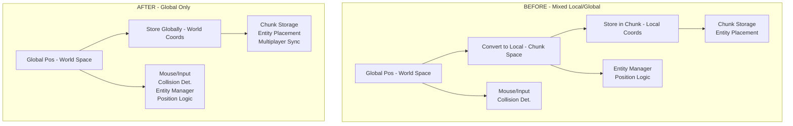

# Global Position Migration Overview

```
╔═══════════════════════════════════════════════════════════════════════╗
║                    GLOBAL POSITION MIGRATION                         ║
║                    Converting All Positions                          ║
║                    From Local to Global                              ║
╚═══════════════════════════════════════════════════════════════════════╝
```

## High Level Overview

This migration addresses the inconsistency in position handling throughout the application by standardizing all entity positions to use global coordinates instead of local chunk-relative coordinates. Currently, some systems store entities with local positions (relative to their chunk) while others use global positions (absolute world coordinates).

The change simplifies position management, eliminates coordinate conversion complexity, and reduces bugs related to position tracking. All entity transforms, mouse following, collision detection, and multiplayer synchronization will operate consistently in global space.

## Files That Will Be Modified

### Core Position System:
- `src/utilities/position/index.ts` - Remove local position type
- `src/utilities/position/types.ts` - Remove local position type  
- `src/utilities/transform/index.ts` - Update default position type

### Entity Management:
- `src/utilities/game/entityManager.ts` - Remove local position conversion
- `src/utilities/multiplayer/entitySync.ts` - Remove local position conversion
- `src/utilities/multiplayer/entitySyncRegistry.ts` - Update position handling

### Chunk System:
- `src/systems/chunkManager/chunk.ts` - Remove toLocalPosition method
- `src/utilities/mouseFollower/index.ts` - Update position calculations

### UI/Display:
- `src/entities/spruceTree/info.tsx` - Update position display

## Position Conversion Architecture



## Key Changes Summary

1. **Remove Position Conversion**: Eliminate all `toLocalPosition()` calls and local coordinate logic
2. **Update Entity Storage**: Store entity positions in global coordinates within chunks
3. **Simplify Mouse Following**: Remove coordinate conversion in mouse follower
4. **Fix Multiplayer Sync**: Use global positions consistently in entity synchronization
5. **Update Type System**: Remove "local" from PositionType enum
6. **Maintain Chunk System**: Chunks still position their containers globally but entities within use global coords

## Benefits

- **Consistency**: All position calculations use the same coordinate system
- **Simplicity**: No coordinate conversion between local and global
- **Performance**: Fewer calculations and transformations
- **Maintainability**: Clearer position logic throughout codebase
- **Bug Reduction**: Eliminates position-related coordinate system bugs

## Implementation Strategy

1. Update type definitions to remove "local" position type
2. Remove position conversion methods and logic
3. Update entity placement to use global coordinates directly
4. Fix multiplayer synchronization to maintain global positions
5. Update UI components that display positions
6. Test entity placement, movement, and chunk loading/unloading
