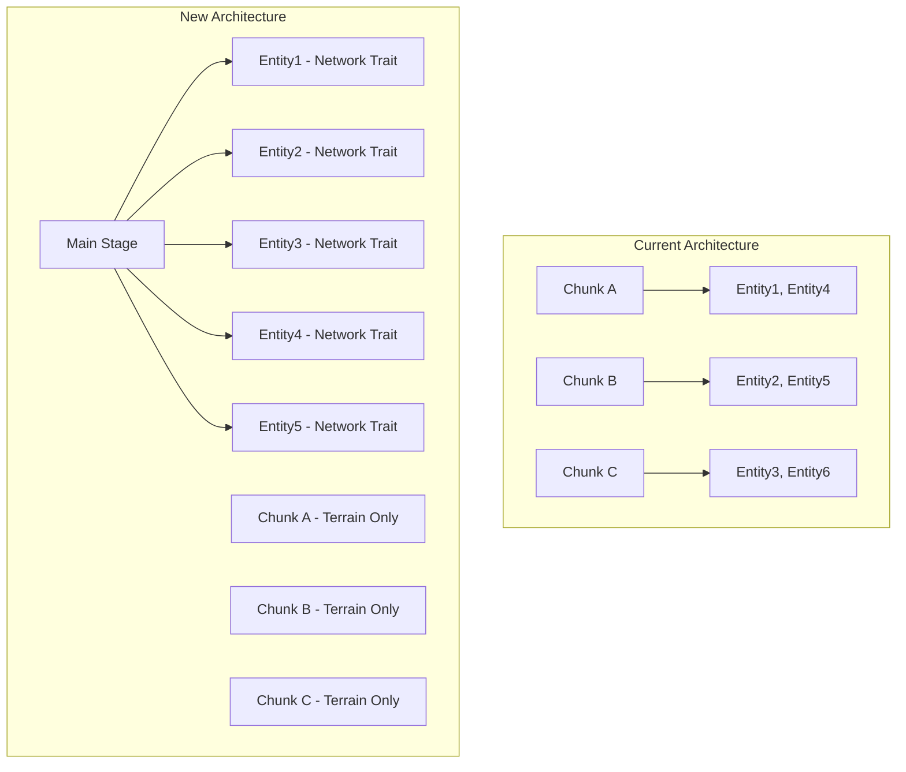
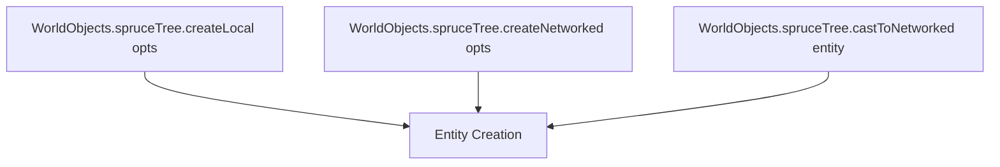
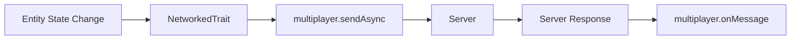

# World Object Architecture Refactor Overview

```
 ██╗    ██╗ ██████╗ ██████╗ ██╗     ██████╗      ██████╗ ██████╗      ██╗███████╗ ██████╗████████╗
 ██║    ██║██╔═══██╗██╔══██╗██║     ██╔══██╗    ██╔═══██╗██╔══██╗     ██║██╔════╝██╔════╝╚══██╔══╝
 ██║ █╗ ██║██║   ██║██████╔╝██║     ██║  ██║    ██║   ██║██████╔╝     ██║█████╗  ██║        ██║   
 ██║███╗██║██║   ██║██╔══██╗██║     ██║  ██║    ██║   ██║██╔══██╗██   ██║██╔══╝  ██║        ██║   
 ╚███╔███╔╝╚██████╔╝██║  ██║███████╗██████╔╝    ╚██████╔╝██████╔╝╚█████╔╝███████╗╚██████╗   ██║   
  ╚══╝╚══╝  ╚═════╝ ╚═╝  ╚═╝╚══════╝╚═════╝      ╚═════╝ ╚═════╝  ╚════╝ ╚══════╝ ╚═════╝   ╚═╝   
                                                                                                     
     ██████╗ ██████╗  ██████╗██╗  ██╗██╗████████╗███████╗ ██████╗████████╗██╗   ██╗██████╗ ███████╗
    ██╔══██╗██╔══██╗██╔════╝██║  ██║██║╚══██╔══╝██╔════╝██╔════╝╚══██╔══╝██║   ██║██╔══██╗██╔════╝
    ██████╔╝██████╔╝██║     ███████║██║   ██║   █████╗  ██║        ██║   ██║   ██║██████╔╝█████╗  
    ██╔══██╗██╔══██╗██║     ██╔══██║██║   ██║   ██╔══╝  ██║        ██║   ██║   ██║██╔══██╗██╔══╝  
    ██║  ██║██║  ██║╚██████╗██║  ██║██║   ██║   ███████╗╚██████╗   ██║   ╚██████╔╝██║  ██║███████╗
    ╚═╝  ╚═╝╚═╝  ╚═╝ ╚═════╝╚═╝  ╚═╝╚═╝   ╚═╝   ╚══════╝ ╚═════╝   ╚═╝    ╚═════╝ ╚═╝  ╚═╝╚══════╝
```

## High Level Overview

This refactor represents a fundamental architectural shift in how world objects are managed within the Haven game engine. The current system tightly couples entities to chunks, making them children of chunk containers which creates unnecessary complexity in rendering, positioning, and cleanup. This refactor will decouple entities from chunks, implement a trait-based networking system, and create a factory pattern that provides both local and networked entity creation capabilities.

The refactor addresses three core architectural concerns: chunk-entity decoupling for simplified rendering, automatic network synchronization through traits, and a unified factory pattern that provides both local and networked object creation with proper typing and async promise resolution for server interactions.

## Files That Will Be Modified

### Core Architecture Files
- `src/systems/world.ts` - World object management and chunk relationship changes
- `src/systems/chunks/` - Chunk system files to remove entity management
- `src/systems/multiplayer.ts` - Enhanced with async message handling
- `src/traits/NetworkedTrait.ts` - New trait for automatic network synchronization

### Factory System Files
- `src/utilities/createObjectFactory.ts` - New factory creation utility
- `src/worldObjects.ts` - New global WorldObjects registry
- `src/objects/` - All existing object files will be updated to use new factory pattern

### Entity Files (Examples)
- `src/objects/spruceTree/` - Updated to use new factory pattern
- `src/objects/player/` - Updated for trait-based networking
- `src/objects/*/` - All entities updated for new architecture

### Type Definition Files
- `src/shared/types.ts` - New factory and networking types
- `src/types/` - Additional type files as needed

## Architectural Diagram



**Factory Pattern Flow:**



**Networking Flow:**



## Implementation Steps

### ✅ Step 1: Chunk-Entity Decoupling - COMPLETED
- ✅ Modified chunk system to only handle terrain rendering
- ✅ Updated world system to manage entities at main stage level
- ✅ Removed entity cleanup logic from chunks
- ✅ Updated entity positioning to use global coordinates

### ✅ Step 2: Enhanced Multiplayer System - COMPLETED
- ✅ Enhanced multiplayer client with async message handling
- ✅ Implemented promise-based server communication
- ✅ Added sendAsync method for entity operations

### ✅ Step 3: Factory Pattern Implementation - COMPLETED
- ✅ Created createObjectFactory utility with proper TypeScript typing
- ✅ Implemented createLocal, createNetworked, and castToNetworked functions
- ✅ Created global WorldObjects registry
- ✅ Updated existing entity factories to use new pattern

### 🔄 Step 4: NetworkedTrait Integration - IN PROGRESS
- ✅ NetworkTrait already exists and works
- 🔄 Need to integrate with new factory pattern
- 🔄 Update trait to work seamlessly with async operations

### 🔄 Step 5: Server Response Handling - PENDING
- 🔄 Update server to handle async message responses
- 🔄 Implement proper entity creation confirmation flow
- 🔄 Add error handling for failed entity creation

## Final Considerations

This refactor will significantly improve the maintainability and extensibility of the world object system. The decoupling of entities from chunks simplifies the rendering pipeline and eliminates complex cleanup procedures. The trait-based networking system provides transparent synchronization without requiring manual implementation in each entity type. The factory pattern creates a consistent, type-safe API for entity creation that supports both local development/testing and networked gameplay.

The async nature of networked operations will require careful consideration of loading states and error handling in the UI layer. The promise-based approach to server communication will enable better user feedback and optimistic updates in future iterations.
