# ENTITY NETWORK REMOVAL CHUNK UNLOAD FIX

```
 ███████╗███╗   ██╗████████╗██╗████████╗██╗   ██╗    ███╗   ███╗███████╗████████╗    ███████╗██╗██╗  ██╗
 ██╔════╝████╗  ██║╚══██╔══╝██║╚══██╔══╝╚██╗ ██╔╝    ████╗ ████║██╔════╝╚══██╔══╝    ██╔════╝██║╚██╗██╔╝
 █████╗  ██╔██╗ ██║   ██║   ██║   ██║    ╚████╔╝     ██╔████╔██║█████╗     ██║       █████╗  ██║ ╚███╔╝ 
 ██╔══╝  ██║╚██╗██║   ██║   ██║   ██║     ╚██╔╝      ██║╚██╔╝██║██╔══╝     ██║       ██╔══╝  ██║ ██╔██╗ 
 ███████╗██║ ╚████║   ██║   ██║   ██║      ██║       ██║ ╚═╝ ██║███████╗   ██║       ██║     ██║██╔╝ ██╗
 ╚══════╝╚═╝  ╚═══╝   ╚═╝   ╚═╝   ╚═╝      ╚═╝       ╚═╝     ╚═╝╚══════╝   ╚═╝       ╚═╝     ╚═╝╚═╝  ╚═╝
```

## Overview

Fixed a critical networking bug where entities were sending `entity_remove` events to the server when chunks were being unloaded client-side. This was causing server-side entity inconsistencies and unnecessary network traffic. The solution involved implementing a `notifyServer` parameter throughout the entity destruction pipeline to distinguish between user-initiated entity removal (should notify server) and chunk unloading (client-only cleanup).

The core issue was that chunk unloading would remove entities locally but also send removal notifications to the server, which would then try to remove entities that the server expected to persist. This created a mismatch between client and server entity states.

## Files Modified

### Core Entity Management
- `src/utilities/game/entityManager.ts` - Added `notifyServer` parameter to `removeEntity()` and supporting methods
- `src/objects/base.ts` - Updated `destroy()` method to accept and pass `notifyServer` parameter
- `src/objects/traits/index.ts` - Enhanced `cleanupTraits()` to support trait `destroy()` methods with parameters

### Network Integration  
- `src/objects/traits/network.ts` - Modified to conditionally send entity_remove based on `notifyServer` flag
- `src/utilities/multiplayer/entitySync.ts` - Fixed server-initiated entity removal to not notify server back

### Entity Implementations
- `src/objects/spruceTree/base.ts` - Updated custom `destroy()` method to handle `notifyServer` parameter
- `src/objects/assembler/base.ts` - Updated custom `destroy()` method to handle `notifyServer` parameter

## Change Flow Diagram

```mermaid-js
graph TD
    subgraph "Chunk Unloading Flow"
        A[ChunkManager.unloadChunk] --> B[EntityManager.removeEntitiesForChunk chunkKey]
        B --> C[EntityManager.removeEntity entity, notifyServer: false]
        C --> D[entity.destroy notifyServer: false]
        D --> E[cleanupTraits notifyServer: false]
        E --> F[NetworkTrait.destroy notifyServer: false]
        F --> G[handleEntityDestroy notifyServer: false]
        G --> H[NO server notification]
    end
    
    subgraph "User Entity Removal Flow"
        I[World.destroyEntity] --> J[EntityManager.removeEntity entity - defaults to notifyServer: true]
        J --> K[entity.destroy notifyServer: true]
        K --> L[cleanupTraits notifyServer: true]
        L --> M[NetworkTrait.destroy notifyServer: true]
        M --> N[handleEntityDestroy notifyServer: true]
        N --> O[SENDS entity_remove to server]
    end
```



## Technical Implementation Details

**EntityManager Changes:**
- `removeEntity()` now accepts `notifyServer: boolean = true` parameter
- `removeEntitiesForChunk()` passes `notifyServer: false` to avoid server notifications during chunk unload
- `executeDestroyCallbacks()` passes the `notifyServer` flag to registered destroy callbacks
- Updated `EntityDestroyCallback` type to accept the `notifyServer` parameter

**NetworkTrait Changes:**
- `destroy()` method now accepts and uses `notifyServer` parameter
- `handleEntityDestroy()` only calls `notifyServerEntityRemoved()` when `notifyServer` is true
- Destroy callback registration updated to handle the new parameter signature

**GameObject Base Changes:**
- `destroy()` method signature updated to accept `notifyServer: boolean = true`
- `cleanupTraits()` enhanced to detect and call trait destroy methods with proper parameters
- Smart parameter detection to maintain compatibility with traits that don't support the parameter

## Final Notes

This fix ensures that chunk unloading only removes entities on the client side without sending spurious network messages to the server. Server-initiated entity removals (via EntitySync) also avoid creating circular removal notifications. User-initiated entity destruction continues to properly notify the server as expected.

The implementation maintains backward compatibility by using default parameters and smart parameter detection, ensuring that existing code continues to work while new functionality provides the necessary control over network notifications.
