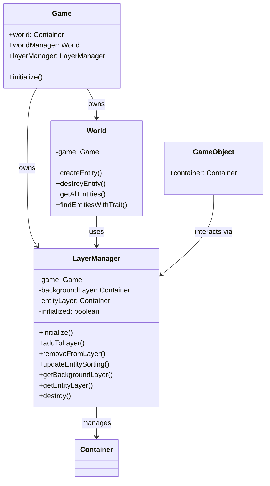

# LAYER MANAGER REFACTOR

```
 _                           __  __                                   
| |    __ _ _   _  ___ _ __  |  \/  | __ _ _ __   __ _  __ _  ___ _ __ 
| |   / _` | | | |/ _ \ '__| | |\/| |/ _` | '_ \ / _` |/ _` |/ _ \ '__|
| |__| (_| | |_| |  __/ |    | |  | | (_| | | | | (_| | (_| |  __/ |   
|_____\__,_|\__, |\___|_|    |_|  |_|\__,_|_| |_|\__,_|\__, |\___|_|   
            |___/                                      |___/           
____       __           _             
|  _ \ ___ / _| __ _  ___| |_ ___  _ __ 
| |_) / _ \ |_ / _` |/ __| __/ _ \| '__|
|  _ <  __/  _| (_| | (__| || (_) | |   
|_| \_\___|_|  \__,_|\___|\__\___/|_|   
```

## High Level Overview

The current World class contains extensive layer management logic that would be better organized 
in a dedicated LayerManager class. This refactor will extract all layer-related functionality 
from the World class into a proper LayerManager class, improving separation of concerns and 
making the layer system more maintainable and testable.

The LayerManager will handle all layer operations including initialization, entity sorting, 
adding/removing objects from layers, and providing a clean API for external systems to 
interact with the rendering layers.

## Files to be Modified

1. **src/types/rendering.ts** - Update type definitions to reflect new LayerManager class
2. **src/utilities/game/layerManager.ts** - Create new LayerManager class (new file)
3. **src/utilities/game/world.ts** - Remove layer logic, simplify to use LayerManager instance
4. **src/utilities/game/game.ts** - Update initialization to use new LayerManager
5. **Multiple files using layer system** - Update imports and usage patterns

## Architecture Diagram



## Implementation Details

### LayerManager Class Features:
- **Proper initialization lifecycle** - Clear init/destroy methods
- **Layer container management** - Direct access to background and entity layers
- **Entity depth sorting** - Automatic y-position based sorting for entities
- **Clean separation** - No mixing of entity creation and layer management
- **Error handling** - Proper validation and error messages
- **Performance optimization** - Efficient sorting and layer operations

### Migration Benefits:
- **Single Responsibility** - LayerManager only handles layers, World only handles entities
- **Testability** - LayerManager can be tested independently
- **Maintainability** - Layer logic is centralized and easier to modify
- **API Clarity** - Clear interface for layer operations
- **Memory Management** - Proper cleanup and resource management

## Final Notes

This refactor will significantly improve the architecture by properly separating concerns. 
The World class will focus purely on entity lifecycle management, while the LayerManager 
will handle all rendering layer operations. This makes both classes more focused, testable, 
and maintainable.

The migration will be backwards compatible - all existing code using the layer system will 
continue to work, but will now be using the more robust LayerManager implementation under 
the hood.
