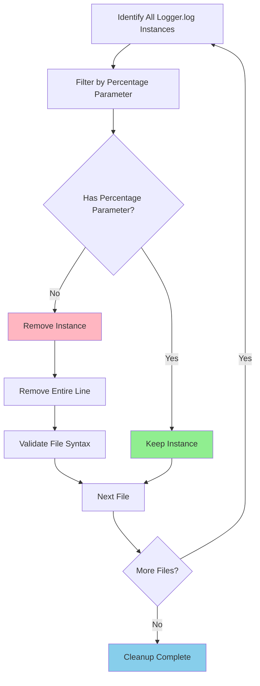

# LOGGER CLEANUP - EXCESSIVE LOGGING REMOVAL

```
 _     ___   ____  ____  _____ ____     ____ _     _____    _    _   _ _   _ ____  
| |   / _ \ / ___|/ ___|| ____|  _ \   / ___| |   | ____|  / \  | \ | | | | |  _ \ 
| |  | | | | |  _| |  _  |  _| | |_) | | |   | |   |  _|   / _ \ |  \| | | | | |_) |
| |__| |_| | |_| | |_| | |___| |  _ < | |___| |___| |___ / ___ \| |\  | |_| |  __/ 
|_____\___/ \____|\____|_____|_| \_\ \____|_____|_____/_/   \_\_| \_|\___/|_|    
```

## High Level Overview

This task involves cleaning up excessive logging throughout the codebase by removing 113 instances of `Logger.log` calls that do not have percentage parameters. The logging system has become too verbose and is cluttering the console output, making it difficult to identify important information during development and debugging.

The cleanup will preserve the single instance of `Logger.log` that includes a percentage parameter (0.001) for controlled logging frequency, while removing all other instances that provide excessive debug information without throttling.

## Files to be Modified

1. **src/utilities/multiplayer/manager.ts** - 1 instance
2. **src/utilities/multiplayer/events/player_update.ts** - 1 instance  
3. **src/utilities/multiplayer/events/load_chunk.ts** - 8 instances
4. **src/utilities/multiplayer/entitySync.ts** - 6 instances
5. **src/utilities/multiplayer/client.ts** - 1 instance
6. **src/utilities/mouseFollower/index.ts** - 4 instances
7. **src/utilities/game/world.ts** - 12 instances
8. **src/utilities/game/game.ts** - 5 instances
9. **src/systems/chunkManager/unloadingManager.ts** - 4 instances
10. **src/systems/chunkManager/renderTexturePool.ts** - 10 instances
11. **src/systems/chunkManager/index.ts** - 11 instances
12. **src/systems/chunkManager/textureBuilder/index.ts** - 1 instance
13. **src/systems/chunkManager/chunk.ts** - 2 instances
14. **src/server/bunServer.ts** - 20 instances (preserving 1 with percentage)
15. **src/server/chunkGenerator.ts** - 5 instances
16. **src/server/webSocketHandler.ts** - 3 instances
17. **src/server/chunkdb.ts** - 8 instances
18. **src/objects/traits/item.ts** - 1 instance
19. **src/objects/spruceTree/base.ts** - 2 instances
20. **src/objects/items/registry.ts** - 1 instance

## Approach Diagram



## Implementation Strategy

The cleanup will be performed systematically by:
1. Processing each file individually using the replace_string_in_file tool
2. Removing complete lines containing Logger.log calls (without percentage parameters)
3. Preserving proper code formatting and structure
4. Maintaining the single instance with percentage parameter in bunServer.ts
5. Ensuring no syntax errors are introduced during the removal process

This will significantly reduce console noise and improve the development experience by removing over 113 unnecessary logging statements while maintaining the controlled logging mechanism that uses percentage parameters for throttling.
