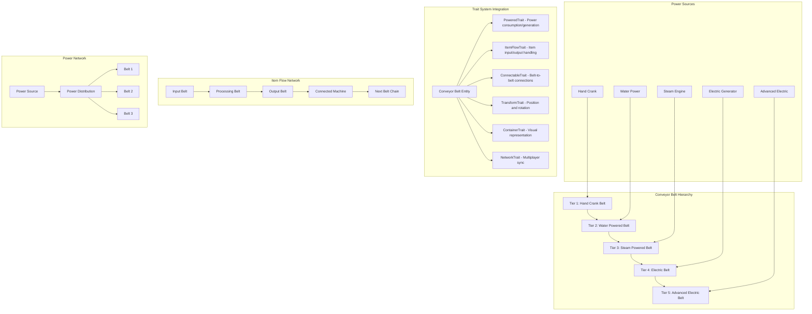

# CONVEYOR BELT SYSTEM ARCHITECTURE OVERVIEW
# =============================================
#   _____ _____ _   _ _   _ _____ _____   _____ _____ 
#  /  __ \  _  | \ | | | |  ___/  __ \ |  _  |  _  |
#  | /  \/ | | |  \| | | | |__ | /  \/ | | | | | | |
#  | |   | | | | . ` | | |  __|| |     | | | | | | |
#  | \__/\ \_/ / |\  \ \_/ / |___| \__/\ \_/ / \_/ /
#   \____/\___/\_| \_/\___/\____/ \____/\___/ \___/ 
#  ______ _____ _     _____   _____  ___ _____ _____ __  __ 
#  | ___ \  ___| |   |_   _| /  ___|/ _ \_   _|  ___/  \/  |
#  | |_/ / |__ | |     | |   \ `--./ /_\ \| | | |__ | .  . |
#  | ___ \  __|| |     | |    `--. \  _  || | |  __|| |\/| |
#  | |_/ / |___| |___  | |   /\__/ / | | || | | |___| |  | |
#  \____/\____/\_____|  \_/   \____/\_| |_/\_/ \____/\_|  |_|

## High-Level Overview

This document outlines the architecture for implementing a multi-tier conveyor belt system in Haven. The system will support 5-10 tiers of conveyor belts with different power requirements, connection systems, and item transport capabilities. The design leverages the existing trait system for modularity while introducing new concepts for power management, directional item flow, and belt connectivity.

The conveyor belt system introduces three new key concepts:
1. **Power System** - Different power sources (hand crank, water, electricity) with varying efficiency
2. **Item Flow Network** - Directional item transport between connected belts and machines
3. **Belt Connectivity** - Smart connection system that allows belts to link and transfer items

## Files That Will Be Modified/Created

### New Conveyor Belt System
- `src/objects/conveyorBelt/base.ts` - Base conveyor belt class with shared functionality
- `src/objects/conveyorBelt/factory.ts` - Factory functions for different belt tiers
- `src/objects/conveyorBelt/info.tsx` - Infographic components for belt inspection
- `src/objects/conveyorBelt/types.ts` - Conveyor belt specific types and interfaces

### New Trait System Extensions
- `src/objects/traits/powered.ts` - Power consumption and generation trait
- `src/objects/traits/itemFlow.ts` - Item input/output and transport trait  
- `src/objects/traits/connectable.ts` - Entity connection and networking trait

### New Power System
- `src/systems/powerSystem/manager.ts` - Global power network management
- `src/systems/powerSystem/types.ts` - Power system type definitions
- `src/systems/powerSystem/calculator.ts` - Power flow calculations

### Updated Core Systems
- `src/objects/traits/types.ts` - Add new trait definitions
- `src/objects/traits/index.ts` - Export new traits
- `src/gameObjects.ts` - Register conveyor belt factories

## Architecture Diagram

## Trait System Integration Strategy

Based on your current architecture, I recommend using the trait system for **most** of the conveyor belt functionality, but keeping the base class for belt-specific logic:

### ✅ Use Traits For:
1. **PoweredTrait** - Power consumption, efficiency, and power source connections
2. **ItemFlowTrait** - Item input/output, transport speed, and buffer management
3. **ConnectableTrait** - Belt-to-belt connections, direction handling, and network pathfinding
4. **Standard Traits** - Transform, Container, Network, Placeable, Ghostable

### 🏗️ Use Base Class For:
1. **Belt-specific rendering** - Animated sprites, direction indicators, item visualization
2. **Tier-specific properties** - Speed multipliers, power requirements, upgrade paths
3. **Belt lifecycle management** - Construction, repair, and destruction logic

## Key Benefits of This Approach

### 🔧 **Trait Modularity**
- PoweredTrait can be reused for other machines (assemblers, miners, etc.)
- ItemFlowTrait enables any entity to participate in item transport networks
- ConnectableTrait allows for complex multi-entity systems

### ⚡ **Power System Flexibility**
- Different power sources can be mixed and matched
- Power efficiency calculations are centralized
- Easy to add new power tiers and sources

### 🔗 **Connection Intelligence**
- Belts automatically detect valid connection points
- Directional flow prevents item loops and conflicts
- Smart pathfinding for complex belt networks

### 📈 **Scalability**
- Easy to add new belt tiers through factory pattern
- Power and item flow systems scale independently
- Network synchronization handles multiplayer complexity

## Implementation Priority

1. **Phase 1**: Basic PoweredTrait and simple hand-crank belts
2. **Phase 2**: ItemFlowTrait and item transport mechanics
3. **Phase 3**: ConnectableTrait and belt-to-belt connections
4. **Phase 4**: Advanced power sources and tier progression
5. **Phase 5**: Complex networks and optimization features

This architecture leverages your existing systems while introducing the necessary new concepts for a robust conveyor belt system. The trait-based approach ensures modularity and reusability while maintaining the clean factory pattern you've established.
