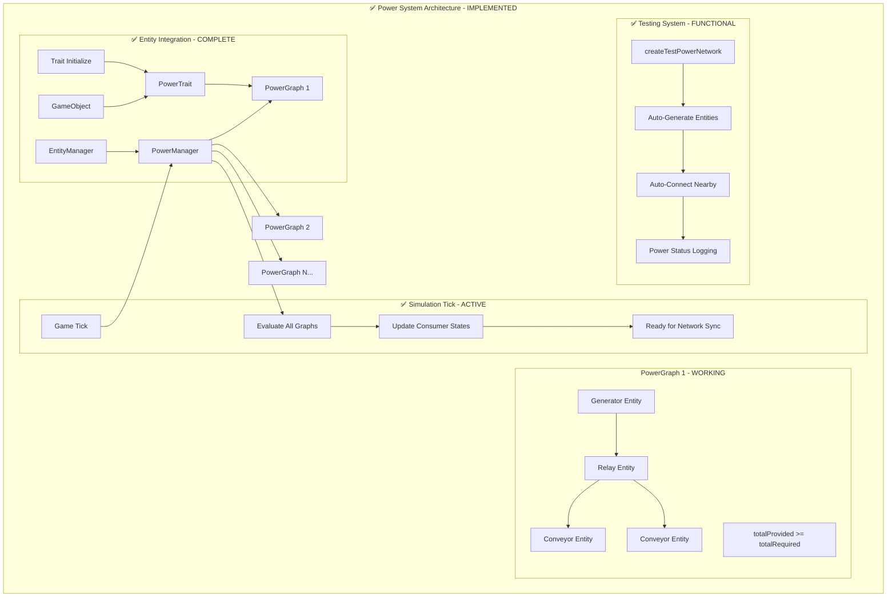

```
 ____   ___  _    _ _____ ____     ______   _______ _____ __  __
|  _ \ / _ \| |  | |  __ \  _ \   / ___\ \ / / ____|_   _|  \/  |
| |_) | | | | |  | | |__) | |_) | |    \ V /|  ___   | | | \  / |
|  _ <| | | | |  | |  ___/|  _ <  |     > < | |___   | | | |\/| |
| |_) | |_| | |__| | |    | |_) | |____|/ . \|  _|   | | | |  | |
|_____/\___/ \____/|_|    |____/ \______/_/ \_\_|   |_| |_|  |_|
   ___ __  __ ____  _     _____ __  __ _____ _   _ _____  _  _____ ___ ___  _   _ 
  |_ _|  \/  |  _ \| |   | ____|  \/  | ____| \ | |_   _|/ \|_   _|_ _/ _ \| \ | |
   | || |\/| | |_) | |   |  _| | |\/| |  _| |  \| | | | / _ \ | |  | | | | |  \| |
   | || |  | |  __/| |___| |___| |  | | |___| |\  | | |/ ___ \| |  | | |_| | |\  |
  |___|_|  |_|_|   |_____|_____|_|  |_|_____|_| \_| |_/_/   \_\_| |___\___/|_| \_|
                                    COMPLETED IMPLEMENTATION
```

## High-Level Overview

The power system has been successfully implemented as an efficient graph-based model for simulating power distribution across connected game objects without requiring per-node traversal during simulation ticks. The system uses PowerGraphs to represent connected networks of power providers and consumers, with binary power states determined by comparing total provided power against total required power.

The system supports mechanical and electrical power networks, where entities can be producers, consumers, relays, or batteries. Each PowerGraph maintains aggregated metrics and evaluates power distribution once per simulation tick, making it highly scalable for large networks of connected entities. The implementation includes automatic entity registration, graph management, connection handling, and real-time power state synchronization.

## Files Modified/Created

### ✅ New Files Created:
- `src/systems/power/types.ts` - Power system type definitions
- `src/systems/power/PowerGraph.ts` - Core graph representation with BFS connectivity
- `src/systems/power/PowerManager.ts` - Global power system manager with auto-connection
- `src/systems/power/index.ts` - Power system exports
- `src/objects/conveyorBelt/base.ts` - Example power consumer entity
- `src/objects/conveyorBelt/factory.ts` - Conveyor belt factory with network sync
- `src/objects/conveyorBelt/info.tsx` - React infographic with power status
- `src/objects/powerGenerator/base.ts` - Example power producer entity
- `src/objects/powerGenerator/factory.ts` - Power generator factory
- `src/objects/powerGenerator/info.tsx` - React infographic with generation status

### ✅ Modified Files:
- `src/objects/traits/powered.ts` - Enhanced PowerTrait with graph integration and connections
- `src/objects/traits/types.ts` - Updated trait type definitions
- `src/objects/traits/index.ts` - Added PoweredTrait initialization and cleanup
- `src/utilities/game/game.ts` - Integrated PowerManager and simulation tick
- `src/utilities/game/entityManager.ts` - Added power system registration/cleanup
- `src/utilities/infographics/index.ts` - Added power entity infographic types

## System Architecture - IMPLEMENTED



## Implementation Details - COMPLETED

### ✅ PowerGraph System
- **IMPLEMENTED**: Connected network management with BFS traversal
- **IMPLEMENTED**: Aggregated power metrics (totalProvided/totalRequired)  
- **IMPLEMENTED**: Binary power state evaluation for entire networks
- **IMPLEMENTED**: Automatic graph splitting/merging on connection changes
- **IMPLEMENTED**: Graph fragmentation detection with component analysis

### ✅ PowerManager Integration - ENHANCED
- **IMPLEMENTED**: Global registry of all PowerGraphs
- **IMPLEMENTED**: Automatic entity registration through EntityManager
- **IMPLEMENTED**: Connection management with auto-connect utilities
- **IMPLEMENTED**: Simulation tick coordination (runs every frame)
- **IMPLEMENTED**: Power state update events and listeners
- **IMPLEMENTED**: Entity-specific power state change callbacks
- **IMPLEMENTED**: Graph ID management and trait synchronization

### ✅ PowerTrait Enhancement - REFACTORED
- **IMPLEMENTED**: Graph ID storage instead of duplicate power state
- **IMPLEMENTED**: Power state queries through PowerManager
- **IMPLEMENTED**: Event-driven power state change notifications  
- **IMPLEMENTED**: Power production/consumption metrics
- **IMPLEMENTED**: Connection tracking and validation methods
- **IMPLEMENTED**: Game instance integration for manager access

### ✅ Entity Examples
- **IMPLEMENTED**: ConveyorBelt (power consumer with visual state changes)
- **IMPLEMENTED**: PowerGenerator (power producer with constant output)
- **IMPLEMENTED**: Full factory pattern integration with network sync
- **IMPLEMENTED**: React-based infographics with real-time power status

### ✅ Testing & Debugging
- **IMPLEMENTED**: `game.createTestPowerNetwork()` - Creates test network at cursor
- **IMPLEMENTED**: `powerManager.logPowerSystemStatus()` - Detailed system logging
- **IMPLEMENTED**: Auto-connection utilities for nearby entities
- **IMPLEMENTED**: Visual power state indicators in entity infographics

## Usage Instructions

The power system is fully functional and integrated into the game. To test:

1. **Console Testing**: Use `game.createTestPowerNetwork()` in browser console
2. **Entity Placement**: Place power generators and conveyor belts via hotbar
3. **Connection**: Entities auto-connect when placed within 64 pixels
4. **Monitoring**: Hover over entities to see power status in infographics
5. **Debugging**: Use `game.powerManager.logPowerSystemStatus()` for detailed logs

The system automatically handles entity lifecycle, power distribution, graph management, and visual updates. All power calculations occur once per simulation tick with O(1) complexity per consumer entity, making it highly scalable for large power networks.
